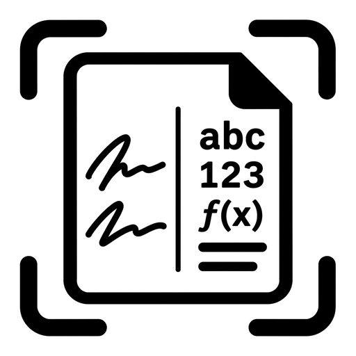
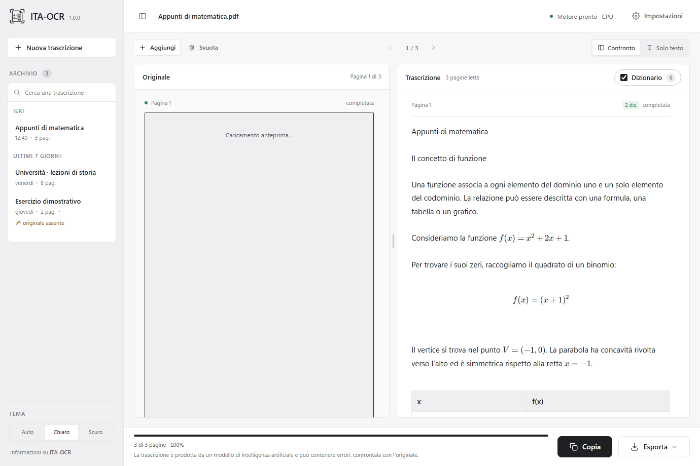
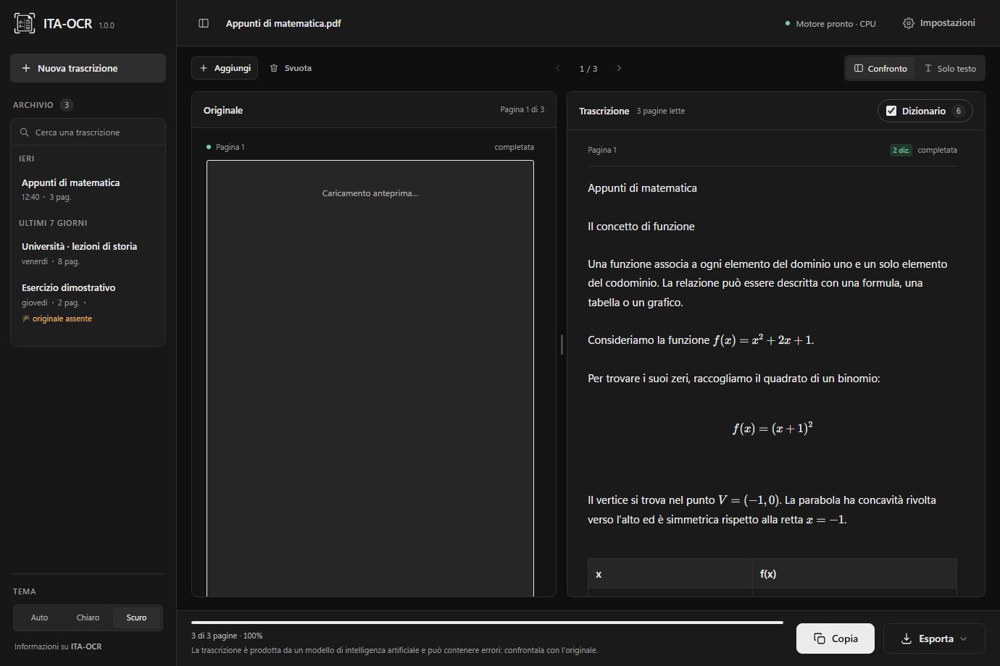
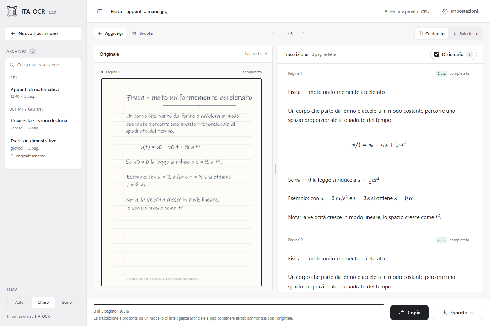
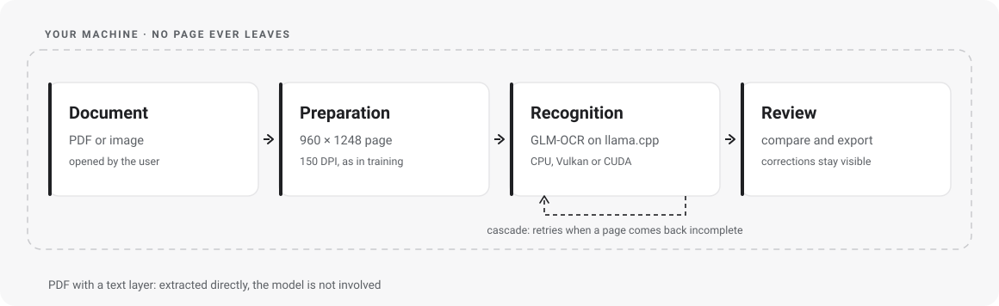
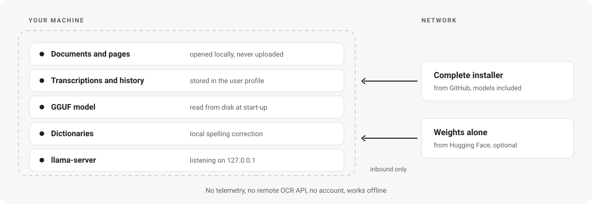

<div align="center">
  
  <h1>ITA-OCR</h1>
  <p><strong>From the page to the text. On your own machine.</strong></p>
  <p>Local OCR for Italian handwriting, built on a fine-tune of GLM-OCR.</p>
  <p>
    <a href="https://GioOtto.github.io/ITA-OCR/en/">Website</a> ·
    <a href="https://github.com/GioOtto/ITA-OCR/releases/latest">Windows download</a> ·
    <a href="docs/en/MODEL.md">Model</a> ·
    <a href="docs/assets/ITA-OCR-report-tecnico.pdf">Technical report</a> ·
    <a href="docs/en/BUILDING.md">Building</a> ·
    <a href="https://github.com/GioOtto/ITA-OCR/issues">Issues</a>
  </p>
  <p>   </p>
  <p><a href="README.md">Italiano</a> · <strong>English</strong></p>
</div>



*Demonstration screenshot with synthetic content. It is not a measure of OCR accuracy.*

## What it is

ITA-OCR is a desktop application that transcribes handwritten Italian pages
and PDF or image documents. Recognition runs on your machine through
[llama.cpp](https://github.com/ggml-org/llama.cpp) with a model derived from
[GLM-OCR](https://huggingface.co/zai-org/GLM-OCR), fine-tuned for Italian
handwriting. No cloud OCR service and no API key are involved.

The interface puts the original next to the result, lets you inspect every
correction and export the text. PDFs that already carry a text layer can be
read directly, without going through the model.

## Download and start

1. Download **ITA-OCR-setup_v1.0.0.exe** from the [Windows release](https://github.com/GioOtto/ITA-OCR/releases/latest).
2. Install it into your user profile: no administrator privileges required.
3. Download the **two GGUF files** listed in the [model guide](docs/en/MODEL.md) separately and place them in the `models` folder next to the application.
4. Open ITA-OCR, import a document, run the transcription and compare it with the original.

The installer ships the application, the engine and the public dictionaries.
**The weights are distributed separately on Hugging Face; the dataset stays
private.** For the full procedure, requirements and troubleshooting see the
[Windows guide](docs/en/INSTALL.md).

## What it does

| Feature | Behaviour |
| --- | --- |
| PDFs and images | Imports PDF, PNG, JPEG, TIFF, BMP, WebP and GIF |
| Comparison | Original and text side by side, page by page |
| PDFs with text | Direct extraction; OCR can be forced in the settings |
| Spelling correction | Public Italian dictionary, corrections stay highlighted; English terms are protected |
| Formulas and tables | Recognised formulas and tables are rendered in the text |
| Export | Copy to clipboard, export to TXT, Markdown and DOCX |
| Local history | Sessions are stored on your machine |
| Theme | Light, dark or automatic |





*The real use case: a handwritten page on the left, the recognised text on the
right, with the formulas typeset. This page is synthetic too.*

## How it works

<picture>
  <source media="(prefers-color-scheme: dark)" srcset="docs/assets/pipeline-en-dark.svg">
  
</picture>

The pipeline prepares each page, chooses between text extraction and OCR, then
runs a cascade of retries whenever the model returns an incomplete or repetitive
result. Spelling correction and export happen locally. Tauri connects the
HTML/CSS/JavaScript interface to the Rust backend.

The engine supports CPU, Vulkan and CUDA where hardware, drivers and package
allow it. Local Windows testing was carried out on an AMD Radeon RX 7900 XT
with Vulkan; that does not imply equivalent performance on every GPU.

## How much better than the base model

The fine-tune lowers the error on every evaluation set available, on both axes.
The figures come from the [technical report](docs/assets/ITA-OCR-report-tecnico.pdf),
each with the set it was measured on — because a percentage without its set
means nothing.

| Evaluation set | Character error | Word error |
| --- | --- | --- |
| Holdout, 164 pages, writers never seen in training | 30.9 → 25.7 (**−16.7%**) | 54.7 → 45.5 (**−16.7%**) |
| Sealed benchmark, 67 readable pages | 29.3 → 18.8 (**−35.9%**) | 56.7 → 39.0 (**−31.3%**) |
| Subset declared easy, 61 pages | 12.1 → 11.3 (−6.5%) | 37.0 → 30.7 (−17.0%) |

A second effect matters as much, and a percentage hides it: **pages lost drop
from 24 to 5** on a 48-page panel of problematic pages. That is the cascade at
work, recognising a decode that ended badly and retrying. And it costs less than
not having it: on the holdout the whole cascaded run is faster than a single
plain pass, because runaway pages are cut short instead of running to the token
ceiling.

These are relative reductions on those sets, not a universal accuracy figure.
The final set was consulted several times during development: the measurements
are descriptive, not an independent benchmark. Full method and limits in
[BENCHMARKS.md](docs/en/BENCHMARKS.md).

## Do I need a GPU?

No. The model also runs on the CPU, at the same quality: only the time changes.

On the test machine a page goes from a little over a second and a half on the
GPU to roughly fifteen seconds on the CPU — about an order of magnitude. The
absolute values depend on the processor, the graphics card, the drivers and the
complexity of the page, so read them as a ratio rather than a promise: another
machine will produce other numbers with the same gap.

On the CPU the time goes mostly into encoding the image rather than generating
the text, and quantisation buys memory rather than latency: around 2.4 GB
resident with the Q8_0 weights that ship.

## Local processing and personal data

<picture>
  <source media="(prefers-color-scheme: dark)" srcset="docs/assets/privacy-en-dark.svg">
  
</picture>

Pages never leave the device. The engine listens on `127.0.0.1` only, there is
no telemetry, no account is required, and once the application and the weights
are installed recognition works with no connection at all.

For anyone handling personal data this narrows the perimeter in a concrete way:
there is no external processor involved in the OCR step, no transfer to third
countries, and the documents stay under the control of whoever holds them. That
is the substantive difference from a cloud OCR service.

**This is not a certification.** GDPR compliance remains the responsibility of
the data controller and depends on the legal basis, the privacy notice,
retention periods, device security and the handling of the local history —
which ITA-OCR stores in the user profile and which uninstalling does not
remove. See [PRIVACY.md](docs/en/PRIVACY.md) and [SECURITY.md](.github/SECURITY.md).

## Model, data and limits

- **Base model:** GLM-OCR by Z.ai; the upstream model card declares the base weights MIT.
- **Adaptation:** fine-tuned for Italian handwriting, distributed in GGUF together with the matching vision projector — [`ueuegio/ITA-OCR`](https://huggingface.co/ueuegio/ITA-OCR).
- **Dataset:** private. It is not part of the repository, the website, the installer or the screenshots.
- **Technical report:** [*Teaching a Vision Model When to Stop*](docs/assets/ITA-OCR-report-tecnico.pdf) — the fine-tune, the termination collapse and the inference cascade.
- **Evaluation:** [method and limits](docs/en/BENCHMARKS.md); no real examples, identifiers or per-person results are published.
- **Accuracy:** OCR can omit, repeat or invent text, especially on complex layouts, formulas or difficult handwriting. Always check the result against the original.

Advanced context-aware correction needs additional local lexical resources that
are not part of this distribution. The standard corrector works with the public
dictionaries alone.

## Development

```powershell
git clone --recurse-submodules https://github.com/GioOtto/ITA-OCR.git
cd ITA-OCR
```

See [BUILDING.md](docs/en/BUILDING.md) for the toolchain and the build.

```text
docs/                       static website: index.html, en/index.html, assets/
docs/en/                    guides in English
docs/it/                    guides in Italian
.github/                    contributing, security and the build workflow
ocr-desktop/app/src-tauri/  Rust backend and Tauri configuration
ocr-desktop/app/ui/         interface and assets
ocr-desktop/resources/      public dictionaries and their licences
ocr-desktop/scripts/        icon generation, build and installer
ocr-desktop/smoke/          UI checks with synthetic content
ocr-ita/vendor/llama.cpp/   engine submodule
scripts/                    diagrams, screenshots and publication check
licenses/                   third-party notices and licences
```

Contributions and reports: [CONTRIBUTING.md](.github/CONTRIBUTING.md).

## Statement on the use of AI

**The code, part of the documentation and the graphic assets were produced with
the help of artificial-intelligence tools.** That assistance is not a guarantee
of correctness, security or accuracy. The software comes with no warranty;
changes require review and testing, and transcriptions must be verified.

## Licences

The original ITA-OCR code is released under the [MIT licence](LICENSE).
Third-party dependencies and data keep their own licences: in particular the
Italian dictionary is GPL-3.0 and `spellbook` is MPL-2.0. The project's MIT
licence does not replace the licences of the bundled components.
See [THIRD-PARTY.md](docs/en/THIRD-PARTY.md) and [licenses/](licenses).

## Contact

Reports and proposals: [repository issues](https://github.com/GioOtto/ITA-OCR/issues).
Direct contact: **giorgio.ottoboni@proton.me**.
For vulnerabilities, follow [SECURITY.md](.github/SECURITY.md) first.
