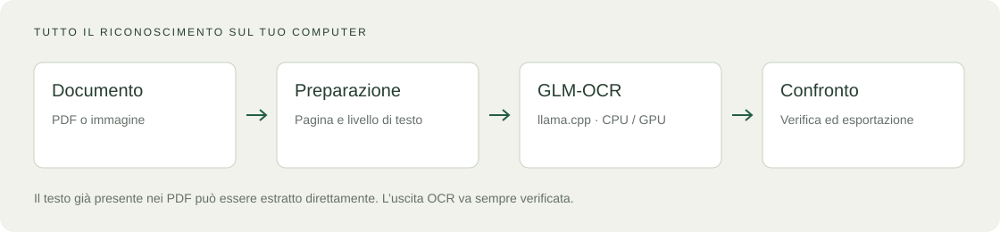

<div align="center">
  
  <h1>ITA-OCR</h1>
  <p><strong>Dalla pagina al testo. Sul tuo computer.</strong></p>
  <p>OCR locale per la scrittura italiana, con un fine-tuning di GLM-OCR.</p>
  <p>
    <a href="https://GioOtto.github.io/ITA-OCR/">Sito</a> ·
    <a href="https://github.com/GioOtto/ITA-OCR/releases/latest">Download Windows</a> ·
    <a href="docs/MODELLO.md">Modello</a> ·
    <a href="docs/assets/ITA-OCR-report-tecnico.pdf">Report tecnico</a> ·
    <a href="LEGGIMI-WINDOWS.md">Compilare</a> ·
    <a href="https://github.com/GioOtto/ITA-OCR/issues">Segnalazioni</a>
  </p>
  <p>  </p>
</div>


*Schermata dimostrativa dell’interfaccia con contenuti sintetici. Non è una misura dell’accuratezza OCR.*

## Che cos’è

ITA-OCR è un’app desktop per trascrivere pagine scritte a mano in italiano e
documenti PDF o immagine. Il riconoscimento gira sul computer con
[llama.cpp](https://github.com/ggml-org/llama.cpp) e un modello derivato da
[GLM-OCR](https://huggingface.co/zai-org/GLM-OCR). Non serve un servizio OCR cloud
né una chiave API per trascrivere.

L’interfaccia affianca originale e risultato, permette di controllare le
correzioni e di esportare il testo. I PDF con testo già presente possono
essere letti direttamente, senza passare dal modello.

## Scarica e inizia

1. Scarica **ITA-OCR-setup_v1.0.0.exe** dalla [release Windows](https://github.com/GioOtto/ITA-OCR/releases/latest).
2. Installa l’app nel tuo profilo utente: non richiede privilegi di amministratore.
3. Scarica separatamente i **due file GGUF** indicati nella [guida al modello](docs/MODELLO.md) e mettili nella cartella `models` accanto all’app.
4. Apri ITA-OCR, importa un documento, avvia la trascrizione e confrontala con l’originale.

L’installer contiene applicazione, motore e dizionari pubblici. **I pesi sono
distribuiti separatamente su Hugging Face; il dataset resta privato.** Per la
procedura completa, i requisiti e la risoluzione dei problemi vedi la
[guida Windows](docs/INSTALLAZIONE.md).

## Cosa puoi fare

| Funzione | Comportamento |
| --- | --- |
| PDF e immagini | Importazione di PDF, PNG, JPEG, TIFF, BMP, WebP e GIF |
| Confronto | Originale e testo affiancati, con navigazione per pagina |
| PDF con testo | Estrazione diretta; OCR forzabile nelle impostazioni |
| Correzione lessicale | Dizionario italiano pubblico, correzioni evidenziate; protezione dei termini inglesi |
| Formule e tabelle | Visualizzazione delle formule riconosciute e delle tabelle nel testo |
| Esportazione | Copia negli appunti ed esportazione TXT, Markdown e DOCX |
| Archivio locale | Sessioni salvate sul computer |
| Tema | Chiaro, scuro o automatico |


## Come funziona



La pipeline prepara le pagine, sceglie fra estrazione del testo e OCR, poi
esegue una cascata di tentativi quando il modello produce un risultato
incompleto o ripetitivo. La correzione lessicale e l’esportazione avvengono
localmente. Tauri collega l’interfaccia HTML/CSS/JavaScript al backend Rust.

Il motore supporta CPU, Vulkan e CUDA quando hardware, driver e pacchetto
sono compatibili. Il collaudo Windows locale è stato eseguito su AMD Radeon
RX 7900 XT con Vulkan. Non implica prestazioni equivalenti su ogni GPU.

## Modello, dati e limiti

- **Modello base:** GLM-OCR di Z.ai; pesi base dichiarati MIT nella model card upstream.
- **Adattamento:** fine-tuning per la scrittura italiana, distribuito in GGUF insieme al proiettore visivo compatibile.
- **Dataset:** privato, non incluso nel repository, nel sito, nell’installer o nelle schermate.
- **Report tecnico:** [*Teaching a Vision Model When to Stop*](docs/assets/ITA-OCR-report-tecnico.pdf) — fine-tuning, collasso della terminazione e cascata di inferenza.
- **Valutazione:** [metodo e limiti](BENCHMARKS.md); non vengono pubblicati esempi reali, identificatori o risultati per persona.
- **Accuratezza:** l’OCR può omettere, ripetere o inventare testo, soprattutto con pagine complesse, formule o scrittura difficile. Verifica ogni risultato sull’originale.

La correzione contestuale avanzata richiede risorse lessicali locali aggiuntive
che non sono incluse nella distribuzione. Il correttore standard funziona
con i soli dizionari pubblici.

## Privacy

I documenti vengono elaborati sul computer. L’app comunica con il motore
attraverso l’indirizzo di loopback; non invia le pagine a un servizio OCR remoto.
Download iniziali, pagine web aperte dall’utente e aggiornamenti dei componenti
di sistema richiedono eventualmente una connessione. Archivio e log sono locali:
controllali prima di allegarli a una segnalazione.

Le schermate pubbliche usano esclusivamente dati sintetici. Vedi
[PRIVACY.md](PRIVACY.md) e [SECURITY.md](SECURITY.md).

## Sviluppo

```powershell
git clone --recurse-submodules https://github.com/GioOtto/ITA-OCR.git
cd ITA-OCR
```

Segui [LEGGIMI-WINDOWS.md](LEGGIMI-WINDOWS.md) per toolchain e build.

```text
ocr-desktop/app/src-tauri/     backend Rust e configurazione Tauri
ocr-desktop/app/ui/            interfaccia e asset
ocr-desktop/resources/         dizionari pubblici e relative licenze
ocr-desktop/scripts/           generazione icone, build e installer
ocr-desktop/smoke/             prove UI con contenuti sintetici
ocr-ita/vendor/llama.cpp/      submodule del motore
docs/                         sito statico, immagini e guide
licenses/                     avvisi e licenze delle dipendenze
```

Contributi e segnalazioni: [CONTRIBUTING.md](CONTRIBUTING.md).

## Dichiarazione sull’uso dell’AI

**Il codice, parte della documentazione e gli asset grafici sono stati
realizzati con il supporto di strumenti di intelligenza artificiale.**
Questo supporto non costituisce una garanzia di correttezza, sicurezza o
accuratezza. Il software è fornito senza garanzie; le modifiche richiedono
revisione e verifiche, e le trascrizioni devono essere controllate.

## Licenze

Il codice originale di ITA-OCR è distribuito sotto [licenza MIT](LICENSE).
Le dipendenze e i dati di terze parti conservano le rispettive licenze:
in particolare, il dizionario italiano è GPL-3.0 e `spellbook` è MPL-2.0.
La licenza MIT del progetto non sostituisce quelle dei componenti inclusi.
Vedi [TERZE-PARTI.md](TERZE-PARTI.md) e [licenses/](licenses/).
