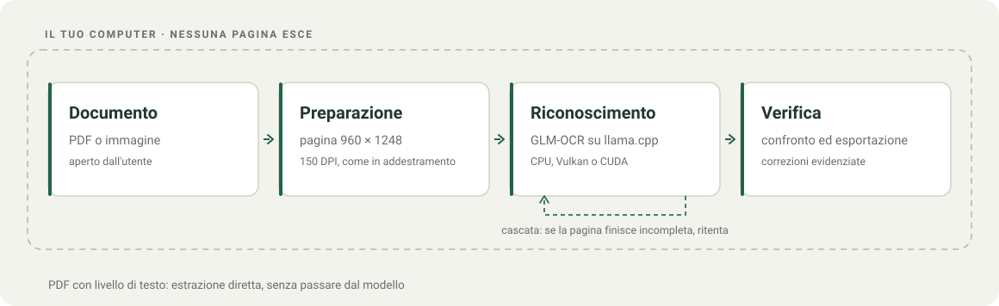
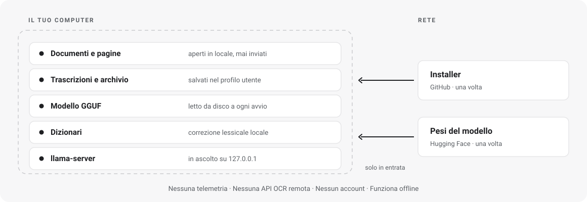

<div align="center">
  
  <h1>ITA-OCR</h1>
  <p><strong>OCR per la scrittura italiana, sul tuo computer.</strong></p>
  <p>App per Windows e Linux con un fine-tuning di GLM-OCR. Il riconoscimento gira in locale.</p>

  <p>
    <a href="https://GioOtto.github.io/ITA-OCR/"></a>
    <a href="https://github.com/GioOtto/ITA-OCR/releases/latest"></a>
    <a href="https://github.com/GioOtto/ITA-OCR/releases/latest"></a>
  </p>

  <p>
    <a href="docs/assets/ITA-OCR-report-tecnico.pdf"></a>
  </p>

  <p>
    <a href="docs/it/INSTALLAZIONE.md">Installazione Windows</a> &nbsp;&nbsp;
    <a href="docs/it/INSTALLAZIONE-LINUX.md">Installazione Linux</a> &nbsp;&nbsp;
    <a href="docs/it/MODELLO.md">Modello</a> &nbsp;&nbsp;
    <a href="docs/it/BENCHMARKS.md">Valutazione</a> &nbsp;&nbsp;
    <a href="https://github.com/GioOtto/ITA-OCR/issues">Segnalazioni</a>
  </p>
  <p>    </p>
  <p><strong>Italiano</strong> &nbsp; <a href="README.en.md">English</a></p>
</div>

<picture>
  <source media="(prefers-color-scheme: dark)" srcset="docs/assets/app-dark.png">
  
</picture>

*Schermata dimostrativa dell’interfaccia con contenuti sintetici. Non è una misura dell’accuratezza OCR.*

## Che cos’è

ITA-OCR è un’app desktop, per Windows e Linux, che trascrive pagine scritte a
mano in italiano e documenti PDF o immagine. Il riconoscimento gira sul computer con
[llama.cpp](https://github.com/ggml-org/llama.cpp) e un modello derivato da
[GLM-OCR](https://huggingface.co/zai-org/GLM-OCR), adattato con un fine-tuning
alla scrittura italiana. Non serve un servizio OCR cloud né una chiave API.

L’interfaccia affianca originale e risultato, permette di controllare le
correzioni e di esportare il testo. I PDF con testo già presente possono
essere letti direttamente, senza passare dal modello.

## Scarica e inizia

Il modo più rapido è il sito: **<https://GioOtto.github.io/ITA-OCR/>**,
che ha il download, le schermate e i risultati in una pagina sola.

### Windows

1. Scarica **ITA-OCR-setup_v1.0.0.exe** dalla [release](https://github.com/GioOtto/ITA-OCR/releases/latest).
2. Installalo nel tuo profilo utente: non richiede privilegi di amministratore.
3. Tieni l’installazione completa, quella predefinita: comprende già i modelli.
4. Apri ITA-OCR, importa un documento, avvia la trascrizione e confrontala con l’originale.

L’installazione completa contiene tutto quello che serve (applicazione, motore,
runtime, dizionari pubblici e i due pesi GGUF) e non richiede altri download.
Durante il setup puoi scegliere un’installazione **senza i modelli**, più
leggera: in quel caso i pesi si prendono
[su Hugging Face](https://huggingface.co/ueuegio/ITA-OCR).
Procedura completa: [guida Windows](docs/it/INSTALLAZIONE.md).

### Linux

1. Scarica **ITA-OCR-v1.0.0-x86_64.AppImage** dalla [release](https://github.com/GioOtto/ITA-OCR/releases/latest).
2. `chmod +x ITA-OCR-v1.0.0-x86_64.AppImage`
3. Prendi i due pesi GGUF [su Hugging Face](https://huggingface.co/ueuegio/ITA-OCR)
   e mettili in una cartella `models` accanto all’AppImage.
4. Avvia il file. Non si installa niente: per rimuoverla, si cancella.

L’AppImage porta con sé applicazione, motore, backend CPU e Vulkan, PDFium e i
dizionari pubblici; **i modelli restano fuori**, perché 1,3 GB in più
sforerebbero il limite di GitHub per un allegato di release. Servono GTK 3,
WebKitGTK 4.1 e libsoup 3 dalla distribuzione, e glibc 2.39 o successiva.
Procedura completa e problemi noti: [guida Linux](docs/it/INSTALLAZIONE-LINUX.md).

**Il dataset di addestramento resta privato**, su entrambe le piattaforme.

## Windows segnalerà l'installer (solo su Windows)

Il pacchetto non è firmato con un certificato Authenticode. Al primo avvio
SmartScreen mostra **«Windows ha protetto il PC»**, e qualche antivirus può
segnalare il file come sospetto: è la reazione standard a un eseguibile poco
diffuso e non firmato, non il rilevamento di codice malevolo. Per procedere:
*Ulteriori informazioni* → *Esegui comunque*.

Non c'è niente da prendere sulla fiducia: il codice è tutto in questo
repository, l'installer è costruito da questi sorgenti con
[gli script inclusi](docs/it/LEGGIMI-WINDOWS.md), e gli hash SHA-256 sono
pubblicati in `SHA256SUMS.txt` accanto alla release. Se preferisci non
eseguire un binario firmato da nessuno, puoi compilarlo tu.

## Cosa puoi fare

| Funzione | Comportamento |
| --- | --- |
| PDF e immagini | Importazione di PDF, PNG, JPEG, TIFF, BMP, WebP e GIF |
| Confronto | Originale e testo affiancati, con navigazione per pagina |
| PDF con testo | Estrazione diretta; OCR forzabile nelle impostazioni |
| Correzione lessicale | Dizionario italiano pubblico, correzioni evidenziate; protezione dei termini inglesi |
| Formule e tabelle | Visualizzazione delle formule riconosciute e delle tabelle nel testo |
| Esportazione | Copia negli appunti ed esportazione TXT, Markdown e DOCX |
| Archivio locale | Sessioni salvate sul computer |
| Tema | Chiaro, scuro o automatico |


*Il caso d’uso vero: una pagina scritta a mano a sinistra, il testo riconosciuto
a destra, con le formule composte. Anche questa pagina è sintetica.*

## Come funziona

<picture>
  <source media="(prefers-color-scheme: dark)" srcset="docs/assets/pipeline-it-dark.svg">
  
</picture>

La pipeline prepara le pagine, sceglie fra estrazione del testo e OCR, poi
esegue una cascata di tentativi quando il modello produce un risultato
incompleto o ripetitivo. La correzione lessicale e l’esportazione avvengono
localmente. Tauri collega l’interfaccia HTML/CSS/JavaScript al backend Rust.

Il motore supporta CPU, Vulkan e CUDA quando hardware, driver e pacchetto
sono compatibili. Il collaudo locale è stato eseguito su AMD Radeon RX 7900 XT
con Vulkan, su Windows e su Linux. Non implica prestazioni equivalenti su ogni
GPU. L’AppImage pubblicata porta i backend CPU e Vulkan; CUDA va compilato
sulla macchina che lo userà, perché `nvcc` non cross-compila.

## Quanto migliora rispetto al modello base

Il fine-tuning riduce l’errore su tutti gli insiemi di valutazione disponibili,
su entrambi gli assi. Le cifre sono quelle del
[report tecnico](docs/assets/ITA-OCR-report-tecnico.pdf), con l’insieme su cui
sono state misurate: una percentuale senza il suo insieme non vuole
dire niente.

| Insieme di valutazione | Errore sui caratteri | Errore sulle parole |
| --- | --- | --- |
| Holdout, 164 pagine, scriventi mai visti in addestramento | 30,9 → 25,7 (**−16,7%**) | 54,7 → 45,5 (**−16,7%**) |
| Benchmark sigillato, 67 pagine leggibili | 29,3 → 18,8 (**−35,9%**) | 56,7 → 39,0 (**−31,3%**) |
| Sottoinsieme dichiarato facile, 61 pagine | 12,1 → 11,3 (−6,5%) | 37,0 → 30,7 (−17,0%) |

Conta anche un secondo effetto, meno visibile in una percentuale: **le pagine
perse passano da 24 a 5** su un pannello di 48 pagine problematiche. È il lavoro
della cascata, che riconosce una decodifica finita male e ritenta. E costa meno
del non averla: sull’holdout l’intera passata con cascata è più rapida di una
passata sola senza, perché le pagine in fuga vengono interrotte invece di
correre fino al limite di token.

Le percentuali sono riduzioni relative su quegli insiemi, non una percentuale
universale di accuratezza. Il set finale è stato consultato più volte durante lo
sviluppo: le misure sono descrittive, non un benchmark indipendente. Metodo
completo e limiti in [BENCHMARKS.md](docs/it/BENCHMARKS.md).

## Il report tecnico

> ### [**Teaching a Vision Model When to Stop**](docs/assets/ITA-OCR-report-tecnico.pdf)
>
> Come si insegna a un modello di visione a smettere di generare: il problema
> che sta dietro a tutti i numeri qui sopra.
>
> GLM-OCR ha **due** condizioni di arresto, e il fine-tuning ne rompe una: il
> modello impara la scrittura italiana e insieme dimentica quando fermarsi,
> così una pagina su tre finisce in un ciclo che si esaurisce solo al limite
> di token. Il report racconta perché succede, perché non si risolve in
> addestramento, e come la **cascata di inferenza** lo aggira riconoscendo una
> decodifica finita male e ritentando, che porta le pagine perse da 24 a 5.
>
> Dentro ci sono anche la costruzione del corpus, il protocollo di
> valutazione con scriventi disgiunti, la quantizzazione e i limiti di tutto
> quanto.
>
> **[→ Leggi il report tecnico (PDF)](docs/assets/ITA-OCR-report-tecnico.pdf)**

## Serve una GPU?

No. Il modello gira anche su CPU, ed è la stessa qualità: cambia solo il tempo.

Sulla macchina di collaudo una pagina passa da poco più di un secondo e mezzo
su GPU a una quindicina di secondi su CPU, circa un ordine di grandezza. I
valori assoluti dipendono da processore, scheda video, driver e complessità
della pagina, quindi vanno presi come rapporto e non come promessa: su un’altra
macchina saranno altri numeri, con lo stesso divario.

Su CPU il tempo se ne va soprattutto nel codificare l’immagine, non nel generare
il testo, e la quantizzazione fa risparmiare memoria più che tempo: circa 2,4 GB
residenti con i pesi Q8_0 distribuiti.

## Elaborazione locale e dati personali

<picture>
  <source media="(prefers-color-scheme: dark)" srcset="docs/assets/privacy-it-dark.svg">
  
</picture>

Le pagine non lasciano il dispositivo. Il motore ascolta solo su `127.0.0.1`,
non c’è telemetria, non serve un account e, una volta installati applicazione
e pesi, il riconoscimento funziona senza connessione.

Per chi tratta dati personali questo riduce il perimetro in modo concreto:
non c’è un responsabile esterno del trattamento per l’OCR, non c’è
trasferimento verso paesi terzi e i documenti restano sotto il controllo di
chi li detiene. È la differenza sostanziale rispetto a un OCR cloud.

**Questo non equivale a una certificazione.** La conformità al GDPR resta in
capo al titolare del trattamento e dipende da base giuridica, informativa,
tempi di conservazione, sicurezza del dispositivo e gestione dell’archivio
locale, che ITA-OCR salva nel profilo utente e che la disinstallazione non
rimuove. Vedi [PRIVACY.md](docs/it/PRIVACY.md) e [SECURITY.md](.github/SECURITY.md).

## Modello, dati e limiti

- **Modello base:** GLM-OCR di Z.ai; pesi base dichiarati MIT nella model card upstream.
- **Adattamento:** fine-tuning per la scrittura italiana, distribuito in GGUF insieme al proiettore visivo compatibile, su [`ueuegio/ITA-OCR`](https://huggingface.co/ueuegio/ITA-OCR).
- **Dataset:** privato, non incluso nel repository, nel sito, nell’installer o nelle schermate.
- **Report tecnico:** [*Teaching a Vision Model When to Stop*](docs/assets/ITA-OCR-report-tecnico.pdf). Tratta il fine-tuning, il collasso della terminazione e la cascata di inferenza.
- **Valutazione:** [metodo e limiti](docs/it/BENCHMARKS.md); non vengono pubblicati esempi reali, identificatori o risultati per persona.
- **Accuratezza:** l’OCR può omettere, ripetere o inventare testo, soprattutto con pagine complesse, formule o scrittura difficile. Verifica ogni risultato sull’originale.

La correzione contestuale avanzata richiede risorse lessicali locali aggiuntive
che non sono incluse nella distribuzione. Il correttore standard funziona
con i soli dizionari pubblici.

## Sviluppo

```bash
git clone --recurse-submodules https://github.com/GioOtto/ITA-OCR.git
cd ITA-OCR
```

Poi [LEGGIMI-WINDOWS.md](docs/it/LEGGIMI-WINDOWS.md) oppure
[LEGGIMI-LINUX.md](docs/it/LEGGIMI-LINUX.md) per toolchain e build. Su Linux
sono tre comandi: `prepara.sh` procura le dipendenze binarie, `costruisci.sh`
compila motore e applicazione, `impacchetta.sh` monta l’AppImage. Entrambe le
piattaforme hanno anche un workflow in [.github/workflows/](.github/workflows).

```text
docs/                       sito statico: index.html, en/index.html, assets/
docs/it/                    guide in italiano
docs/en/                    guide in inglese
.github/workflows/          build di Windows e di Linux
ocr-desktop/app/src-tauri/  backend Rust e configurazione Tauri
ocr-desktop/app/ui/         interfaccia e asset
ocr-desktop/resources/      dizionari pubblici e relative licenze
ocr-desktop/scripts/        icone, build, impacchettamento e installer
ocr-desktop/smoke/          prove UI con contenuti sintetici
ocr-ita/vendor/             submodule: llama.cpp e Vulkan-Headers
scripts/                    schemi, schermate e verifica di pubblicazione
licenses/                   avvisi e licenze delle dipendenze
```

Contributi e segnalazioni: [CONTRIBUTING.md](.github/CONTRIBUTING.md).

## Dichiarazione sull’uso dell’AI

**Il codice, parte della documentazione e gli asset grafici sono stati
realizzati con il supporto di strumenti di intelligenza artificiale.**
Questo supporto non costituisce una garanzia di correttezza, sicurezza o
accuratezza. Il software è fornito senza garanzie; le modifiche richiedono
revisione e verifiche, e le trascrizioni devono essere controllate.

## Licenze

Il codice originale di ITA-OCR è distribuito sotto [licenza MIT](LICENSE).
Le dipendenze e i dati di terze parti conservano le rispettive licenze:
in particolare, il dizionario italiano è GPL-3.0 e `spellbook` è MPL-2.0.
La licenza MIT del progetto non sostituisce quelle dei componenti inclusi.
Vedi [TERZE-PARTI.md](docs/it/TERZE-PARTI.md) e [licenses/](licenses).

## Contatti

Segnalazioni e proposte: [issue del repository](https://github.com/GioOtto/ITA-OCR/issues).
Per contatto diretto: **giorgio.ottoboni@proton.me**.
Per le vulnerabilità segui prima [SECURITY.md](.github/SECURITY.md).

Se ITA-OCR ti è stato utile o il progetto ti è piaciuto, puoi lasciare una
[stella su GitHub](https://github.com/GioOtto/ITA-OCR): aiuta il progetto a
farsi conoscere.
